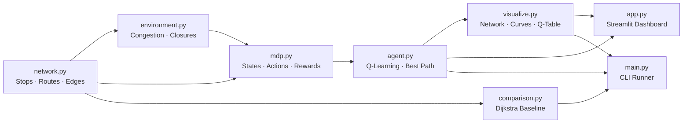

# 🚌 Public Transport Route Optimization Using Q-Learning

A Reinforcement Learning project that trains a **Q-Learning agent** to find the optimal route through a 25-stop public transport network, minimising total journey time under dynamic conditions like congestion and route closures.


---

## 📋 Table of Contents

- [Overview](#overview)
- [Features](#features)
- [Project Structure](#project-structure)
- [Architecture](#architecture)
- [Installation](#installation)
- [Usage](#usage)
- [How It Works](#how-it-works)
- [Configuration](#configuration)
- [Screenshots](#screenshots)

---

## Overview

This project models a city's public transport system as a directed graph with **25 stops** and **25 routes** spanning three transport modes:

| Mode  | Routes | Speed Range | Characteristics |
|-------|--------|-------------|-----------------|
| 🚌 Bus   | 8 routes (Bus1–Bus8) | 15–28 km/h | Covers grid + diagonals |
| 🚇 Metro | 5 routes (Metro1–Metro5) | 55–72 km/h | Fast intercity corridors |
| 🛺 Auto  | 12 routes (Auto1–Auto12) | 13–20 km/h | Short cross-links between rows |

A Q-Learning agent learns to navigate from a **source stop (S0)** to a **destination stop (S24)** by choosing between travelling along a route or transferring at hub stops, while adapting to:

- **Dynamic congestion** (1.0× to 4.0× speed reduction)
- **Random route closures** (configurable probability)
- **Time-of-day headway** (peak vs off-peak wait times)

---

## Features

- **Q-Learning Training** — Configurable episodes, learning rate, discount factor, and exploration rate
- **Dynamic Environment** — Random congestion, route closures, and time-band switching per episode
- **Realistic Travel Time** — `time = (length_km / (base_speed / congestion)) × 60` minutes
- **Hub Transfers** — Agent can transfer between routes at any stop served by 2+ routes
- **Dijkstra Baseline** — Static shortest-path comparison using the same network
- **Interactive Streamlit Dashboard** — Single-page UI with live training progress bar
- **Network Visualisation** — Per-route colored edges with labels, curved arcs for overlapping routes, and optimal path overlay
- **Q-Table Export** — Download the full Q-table as CSV after training

---

## Project Structure

```
Public Transport Route Optimization/
│
├── network.py          # Network topology: 25 stops, 25 routes, edges, hubs, costs
├── environment.py      # Episode environment: congestion, closures, travel time calc
├── mdp.py              # MDP formulation: states, actions, reward function
├── agent.py            # Q-Learning agent: train(), get_best_path(), Q-table export
├── comparison.py       # Dijkstra static baseline for benchmarking
├── visualize.py        # Matplotlib plots: network map, learning curve, Q-table
├── main.py             # CLI entry point: train, extract path, export CSV, show plots
├── app.py              # Streamlit web app: full interactive dashboard
├── .gitignore
└── README.md           # ← You are here
```

---

## Architecture



### Data Flow

1. **`network.py`** defines the graph topology — 25 stops arranged in a 5×5 grid, 25 routes with `length_km` and `base_speed` per edge, hub stops, transfer costs, and headway tables.

2. **`environment.py`** generates per-episode conditions — random congestion factors (1.0–4.0×) per edge, route availability, and wait times based on peak/off-peak. Also provides `make_fixed_env()` for deterministic path extraction.

3. **`mdp.py`** formalises the MDP — state = `(stop, route)`, actions = `travel` (move to next stop on route) or `transfer` (switch route at hub), reward = `-(travel_time + wait + transfer_cost)` with a destination bonus.

4. **`agent.py`** implements tabular Q-Learning with ε-greedy exploration and extracts the greedy best path from the trained Q-table using a fixed environment.

5. **`visualize.py`** produces publication-quality Matplotlib figures — a network map with per-route colored/curved edges, a reward convergence plot, and a per-stop Q-value bar chart.

6. **`app.py`** wraps everything in a Streamlit dashboard with sidebar controls, a single "Run" button, live progress, and colour-coded result tables.

---

## Installation

### Prerequisites

- Python 3.10 or higher

### Steps

```bash
# 1 — Clone the repository
git clone https://github.com/kunjpatel6151/Public-Transport-Route-Optimization.git
cd Public-Transport-Route-Optimization

# 2 — Install dependencies
pip install streamlit matplotlib networkx numpy pandas

# 3 — Verify installation
python -c "import streamlit, matplotlib, networkx, numpy, pandas; print('All dependencies OK')"
```

---

## Usage

### 🖥️ Streamlit Dashboard (recommended)

```bash
streamlit run app.py
```

Then open **http://localhost:8501** in your browser.

1. Configure hyperparameters in the **sidebar** (episodes, α, γ, ε)
2. Set source/destination stops
3. Click **"▶ Run & Find Optimal Path"**
4. View the network map, learning curve, Q-table, and optimal path table
5. Download the Q-table as CSV from the sidebar

### 📟 Command Line

```bash
python main.py
```

This runs training (2000 episodes), prints the best path with per-step details, runs Dijkstra for comparison, exports the Q-table to `qtable_export.csv`, and displays plots.

---

## How It Works

### Travel Time Formula

```
actual_speed = base_speed / congestion_factor
actual_time  = (length_km / actual_speed) × 60   → minutes
```

**Example:** Bus1, S1→S2, length=3.4 km, base_speed=18 km/h, congestion=2.5  
→ actual_speed = 18/2.5 = 7.2 km/h → time = (3.4/7.2)×60 = **28.3 min**

### Q-Learning Update

```
Q(s, a) ← Q(s, a) + α × [R + γ × max_a' Q(s', a') − Q(s, a)]
```

| Parameter | Default | Description |
|-----------|---------|-------------|
| α (alpha) | 0.10 | Learning rate |
| γ (gamma) | 0.90 | Discount factor |
| ε (epsilon) | 1.00 → 0.01 | Exploration rate with 0.995 decay |
| Episodes | 2000 | Training iterations |
| MAX_STEPS | 120 | Max steps per episode |

### Reward Function

| Event | Reward |
|-------|--------|
| Travel to next stop | `-(travel_time + wait_time)` |
| Transfer at hub | `-(transfer_cost + wait_time)` |
| Route unavailable | `-1000` |
| Reach destination | `+200` bonus |

### Network Layout

The 25 stops are arranged in a 5×5 grid:

```
S0  ── S1  ── S2  ── S3  ── S4
│       │       │       │       │
S5  ── S6  ── S7  ── S8  ── S9
│       │       │       │       │
S10 ── S11 ── S12 ── S13 ── S14
│       │       │       │       │
S15 ── S16 ── S17 ── S18 ── S19
│       │       │       │       │
S20 ── S21 ── S22 ── S23 ── S24
```

- **Horizontal buses** (Bus1–Bus5): one per row
- **Vertical buses** (Bus6–Bus8): columns 0, 2, 4
- **Metro lines** (Metro1–Metro5): fast diagonal/vertical corridors
- **Auto links** (Auto1–Auto12): short cross-connections between adjacent rows

---

## Configuration

### Hyperparameters (Sidebar Sliders)

| Parameter | Range | Default | Effect |
|-----------|-------|---------|--------|
| Episodes | 500–5000 | 2000 | More episodes → better convergence |
| Learning rate (α) | 0.01–0.50 | 0.10 | Higher → faster but unstable learning |
| Discount (γ) | 0.50–1.00 | 0.90 | Higher → values future rewards more |
| Initial ε | 0.50–1.00 | 1.00 | Starting exploration rate |
| Closure probability | 0.00–0.30 | 0.10 | Fraction of routes randomly closed |
| Time band | Random / Peak / Off-peak | Random | Controls headway wait times |

### Transfer Costs (minutes)

| From \ To | Bus | Metro | Auto |
|-----------|-----|-------|------|
| **Bus**   | 2   | 8     | 3    |
| **Metro** | 8   | 2     | 5    |
| **Auto**  | 3   | 5     | 2    |

### Headway / Wait Times (minutes)

| Mode  | Peak | Off-Peak |
|-------|------|----------|
| Bus   | 3    | 12       |
| Metro | 4    | 15       |
| Auto  | 1    | 4        |

---

## Screenshots

After launching the app and clicking **"▶ Run & Find Optimal Path"**, you will see:

1. **📊 Training Summary** — Episode count, final average reward, journey time, distance, and whether the destination was reached
2. **🗺️ Network Map** — All 25 routes drawn with individual colors and labels, optimal path highlighted in red
3. **📈 Learning Curve** — Raw and smoothed reward convergence with best-average marker
4. **🔥 Q-Table** — Max Q-value per stop (green = positive, red = negative)
5. **🏁 Optimal Path Table** — Step-by-step route with colour-coded rows (blue = start, purple = transfer, green = destination)

---

## License

This project is developed for academic purposes as part of a B.Tech CSE curriculum project.
